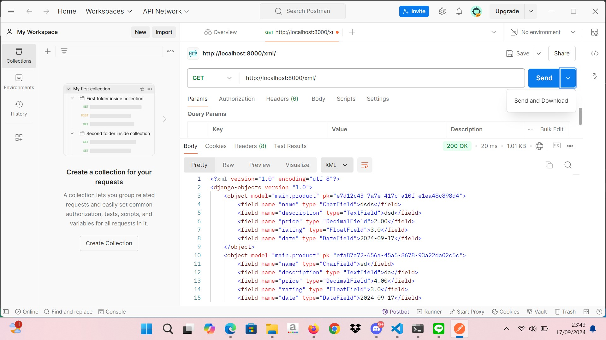
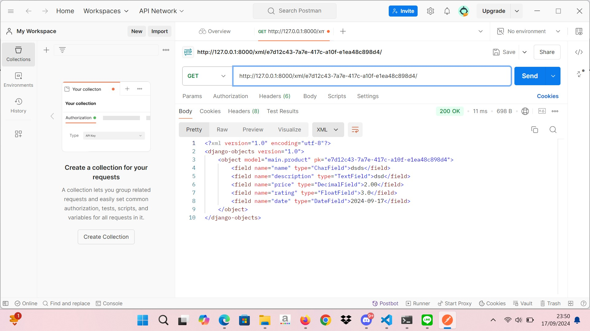
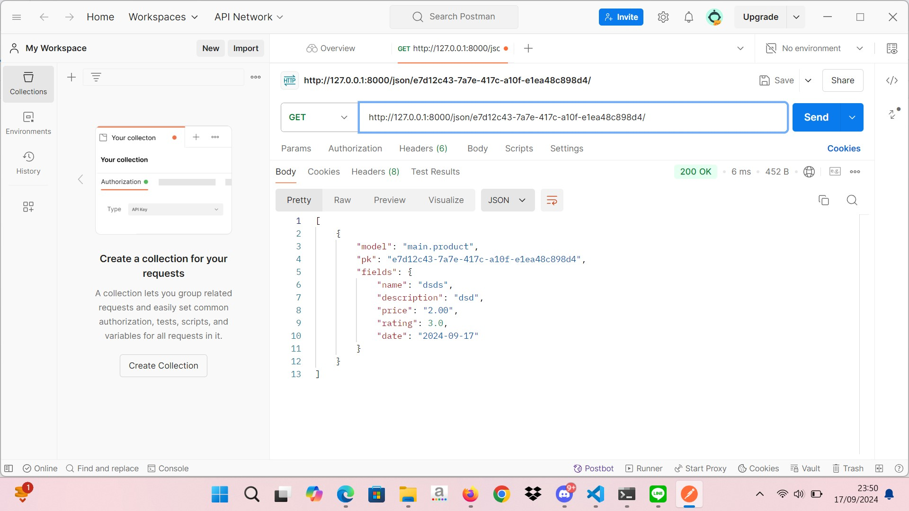

link untuk PWS = http://ismail-yanuar-konohapedia.pbp.cs.ui.ac.id

Tugas 2

[x] Membuat sebuah proyek Django baru.
[x] Membuat aplikasi dengan nama main pada proyek tersebut.
[x] Melakukan routing pada proyek agar dapat menjalankan aplikasi main.
[x] Membuat model pada aplikasi main dengan nama Product dan memiliki atribut wajib sebagai berikut.

    - name
    - price
    - description

[x] Membuat sebuah fungsi pada views.py untuk dikembalikan ke dalam sebuah template HTML yang menampilkan nama aplikasi serta nama dan kelas kamu.
[x] Membuat sebuah routing pada urls.py aplikasi main untuk memetakan fungsi yang telah dibuat pada views.py.
[x] Melakukan deployment ke PWS terhadap aplikasi yang sudah dibuat sehingga nantinya dapat diakses oleh teman-temanmu melalui Internet.
[x] Membuat sebuah README.md yang berisi tautan menuju aplikasi PWS yang sudah di-deploy, serta jawaban dari beberapa pertanyaan berikut.
    Jelaskan bagaimana cara kamu mengimplementasikan checklist di atas secara step-by-step (bukan hanya sekadar mengikuti tutorial).
        Pertama-tama dengan membuat folder baru sesuai nama yang diperlukan, lalu melakukan virtual environment sesuai framework pc masing-masing dan mengaktifkan virtual environment, lalu membuat direktori yaitu requirements.txt yang berisi tools-tools yang dibutuhkan, kemudian buat proyek dengan nama sekreatif mungkin lalu mengonfigurasi proyek dan menjalankan server dengan manambahkan localhost pada ALLOWED_HOSTS dan juga memastikan bahwa file manage.py ada pada folder setalah itu mengaktifkan server dengan perintah "python manage.py runserver" setelah menjalankan server dapat menonaktifkan dengan perintah "deactivate" pada window. Setelah melakukan semua itu, buat repositori pada github dan lakukan git init pada folder yang pertama kali dibuat setelah git init, tambahkan berkas .gitignore dan isi berkas tersebut sesuai dengan yang diperintahkan, lakukan add, commit, dan push dari repositori lokal ke repositori github, lalu buat akun untuk mendeployment pada web yang sudah disediakan lalu register pada web tersebut setelah daftar dan berhasil login, buat project pada web tersebut dan akan muncul credential, lalu pada settings.py di bagian ALLOWED_HOSTS tambahkan URL deployment pws lalu lakukan add, commit, push, setelah itu ganti branch ke master untuk push ke web deployment dengan perintah git push pws main:master dan lakukan add dan commit. 

        Pada direktori ke cmd dengan perintah  "django-admin startproject konohapedia ." dan juga pastikan struktur direktori lokal sudah sesuai, lalu buat aplikasi bernama main dalam folder utama dengan perintah "python manage.py startapp main", lalu ke folder main dan pilih settings.py dan tambahkan "main" pada INSTALLED_APPS, setelah itu implementasikan template dasar dengan membuat folder baru yaitu bernama templates dan buat berkas pada folder templates bernama "main.html" dan isi dengan kode template yang sudah disediakan, setelah itu buat berkas baru pada aplikasi main bernama models.py dan isi dengan kode yang sudah disediakan, lalu migrasi model dengan perintah "python manage.py startapp main" tujuannya untuk melacak perubahan yang belum diaplikasikan ke dalam basis data lalu lalukan perintah "python manage.py startapp main" tujuannya untuk melakukan perubahan, lalu buka berkas views.py pada main dan tambahkan kode-kode yang diperlukan, lalu modifikasi template dan pergi ke berkas "main.html" dan tambahkan kode yang sudah disediakan setelah itu mengonfigurasi routing URL Aplikasi main, pergi ke berkas urls.py pada folder main dan tambahkan kode yang diperlukan setelah itu konfigurasi routing urls proyek buka file berkas pada konohapedia dan buka berkas urls.py dan tambahkan kode yang diperlukan, setelah itu pergi ke cmd dan lakukan perintah "python manage.py runserver" untuk menjalankan server dan melihat hasil dari proyek yang baru saja dibuat dan yang terakhir buat unit tests tujuannya untuk mengatahui dimana letak salahnya proyek yang sudah dibuat dan juga memeriksa kualitas web.

    Buatlah bagan yang berisi request client ke web aplikasi berbasis Django beserta responnya dan jelaskan pada bagan tersebut kaitan antara urls.py, views.py, models.py, dan berkas html.

        request Client, adalah perintah yang diminta oleh user 
               |
        urls.py, adalah permintaan dari request client dan urls.py akan mencocokan sesuai dengan permintaan yang diberikan
               |
        views.py, adalah setelah url ditemukan pada file views.py akan menjalakan sesuai dengan perintah 
               |
        models.py, adalah struktur data yang dipetakan ke database 
               |
        HTML Page, adalah hasil render yang sudah dibuat pada template html

    Jelaskan fungsi git dalam pengembangan perangkat lunak! 
        Git dalam perangkat lunak dapat menyimpan proyek yang telah dibuat, dengan perintah "git add ." akan menambahkan folder dan file yang ada dalam proyek yang telah dibuat, "git commit "..."" untuk membarikan pesan, dan "git push origin main" untuk nge push dari repositori lokal ke repositori github, adalagi yaitu perintah "git branch" untuk menentukan ke branch mana proyek yang akan dipush.

    Menurut Anda, dari semua framework yang ada, mengapa framework Django dijadikan permulaan pembelajaran pengembangan perangkat lunak?
        menurut saya karena popularitasnya sudah rame, aman, dan terpercaya, juga kualitas, performance dari django itu sangat baik, dan simpel, django sudah menyediakan tools-tools untuk membuat proyek.

    Mengapa model pada Django disebut sebagai ORM?
        mengapa disebut sebagai ORM karena ORM (Object-Relational Mapping) menggunakan ORM untuk memetakan objek-objek dalam kode Python ke tabel-tabel dalam database ralasional 
    

Tugas 3

[X] Membuat input form untuk menambahkan objek model pada app sebelumnya.
[X] Tambahkan 4 fungsi views baru untuk melihat objek yang sudah ditambahkan dalam format XML, JSON, XML by ID, dan JSON by ID.
[x] Membuat routing URL untuk masing-masing views yang telah ditambahkan pada poin 2.
[X] Menjawab beberapa pertanyaan berikut pada README.md pada root folder.

    Jelaskan mengapa kita memerlukan data delivery dalam pengimplementasian sebuah platform?
        karena untuk mengirimkan data dari satu stack ke stack lainnya, data yang dikirimkan dapat berbagai variasi, dan juga untuk menukar data  

    Menurutmu, mana yang lebih baik antara XML dan JSON? Mengapa JSON lebih populer dibandingkan XML?
        keduanya baik karena XML dan JSON sama-sama memiliki kelebihan masing-masing, XML sangat baik untuk representasi data yang kompleks sehingga cocok untuk dokumen yang hierarkis atau struktural sedangkan JSON lebih ringan biasa digunakan untuk web sederhana dan tidak terlalu berat dan juga JSON mudah untuk diprosees

    Jelaskan fungsi dari method is_valid() pada form Django dan mengapa kita membutuhkan method tersebut?
        digunakan untuk memvalidasi isi input dari form tersebut dan mengapa kita perlu method tersebut karena untuk memastikan bahwa data yang dikirimkan oleh pengguna sudah sesuai dengan aturan yang diharapkan oleh sistem

    Mengapa kita membutuhkan csrf_token saat membuat form di Django? Apa yang dapat terjadi jika kita tidak menambahkan csrf_token pada form Django? Bagaimana hal tersebut dapat dimanfaatkan oleh penyerang?
         adalah token yang berfungsi sebagai security. Token ini di-generate secara otomatis oleh Django untuk mencegah serangan berbahaya. jika tidak ada csrf_token akan mudah untuk diserang, hal tersebut dapat dimanfaatkan oleh penyerang karena penyerang bisa medapatkan data kredensial pengguna tanpa izin, lalu penyerang dapat mengubah informasi pribadi pengguna.

    Jelaskan bagaimana cara kamu mengimplementasikan checklist di atas secara step-by-step (bukan hanya sekadar mengikuti tutorial).
        memastikan bahwa seluruh file sudah sesuai, membuat direktori templates pada direktori utama, membuat file base.html di dalam direktori templates, lalu pergi ke settings.py pada direktori konohapedia dan mengubah isi yang mengandung TEMPLATES, lalu pada subdirektori templates pada direktori main ubah kodenya, menambahkan baris yaitu import uuid pada models.py di subdirektori main, lalu makemigrations dan migrate, lalu buat berkas baru pada direktori main yang bernama forms.py lalu isi sesuai petunjuk setelah itu buka file views.py pada direktori main dan tambahkan apa yang diperlukan lalu buat fungsi baru yang namanya dapat disesuaikan, lalu ubah fungsi show_main pada berkas views.py, lalu buka urls.py pada direktori main dan import fungsi yang sudah dibuat dan juga tambahkan pattern pada urls.py di direktori main, buat html baru, buka main.html dan tambahkan kode yang diperintahkan, lalu untuk XML buka views.py dan tambahkan apa yang diperlukan, dan buat fungsi yang menerima parameter lalu tambahkan return  HttpResponse, dan buka urls.py lalu diimport fungsi tadi, tambahkan path pada urlpattern yang sudah dibuat sebelumnya. Untuk mengembalikan data dalam format JSON di Django, buat fungsi show_json di views.py yang melakukan query ke semua data MoodEntry dan mengembalikannya dalam format JSON menggunakan HttpResponse. Path URL di urls.py juga harus ditambahkan agar data ini dapat diakses. Untuk mengembalikan data berdasarkan ID dalam format XML atau JSON, buat fungsi show_xml_by_id dan show_json_by_id di views.py, yang memfilter data sesuai ID dan mengembalikannya dalam format yang diinginkan. Tambahkan juga path URL di urls.py untuk mengakses data ini. Selanjutnya, gunakan Postman untuk mengirimkan request GET ke URL seperti http://localhost:8000/json/ untuk memverifikasi pengambilan data. Untuk deployment otomatis ke PWS, buat direktori .github/workflows/ dan tambahkan file deploy.yml yang berisi konfigurasi GitHub Actions, sehingga setiap kali push ke branch main, GitHub akan otomatis push ke PWS. Tambahkan repository secret di GitHub untuk PWS URL dan tambahkan CSRF_TRUSTED_ORIGINS di settings.py untuk mengizinkan URL PWS dalam aplikasi.

[X] Mengakses keempat URL di poin 2 menggunakan Postman, membuat screenshot dari hasil akses URL pada Postman, dan menambahkannya ke dalam README.md.

Tugas 4

[X] Mengimplementasikan fungsi registrasi, login, dan logout untuk memungkinkan pengguna untuk mengakses aplikasi sebelumnya dengan lancar.
[X] Membuat dua akun pengguna dengan masing-masing tiga dummy data menggunakan model yang telah dibuat pada aplikasi sebelumnya untuk setiap akun di lokal.
[X] Menghubungkan model Product dengan User.
[X] Menampilkan detail informasi pengguna yang sedang logged in seperti username dan menerapkan cookies seperti last login pada halaman utama aplikasi.
[X] Menjawab beberapa pertanyaan berikut pada README.md pada root folder (silakan modifikasi README.md yang telah kamu buat sebelumnya; tambahkan subjudul untuk setiap tugas).

    Apa perbedaan antara HttpResponseRedirect() dan redirect()
        HttpResponseRedirect(): Mengarahkan ke URL yang spesifik
        redirect(): Shortcut yang lebih fleksibel, bisa menerima nama view, URL, atau model instance.

    Jelaskan cara kerja penghubungan model Product dengan User!
        Menunjukkan setiap produk memiliki satu user yang jadi pemiliknya, jadi ketika user login dan masuk ke menu utama itu adalah akun milik user tersebut, user itu bebas untuk membeli barang dan memilih barang, dan juga jika akun user tersebut dihapus maka semua barang yang sudah dipesan akan hilang. 

    Apa perbedaan antara authentication dan authorization, apakah yang dilakukan saat pengguna login? Jelaskan bagaimana Django mengimplementasikan kedua konsep tersebut.
        Authentikasi adalah pada saat login akan diminta username dan password, hal itu agar tau siapa yang masuk, dan program akan berpindah ke akun orang tersebut, serta data atau informasi masih tersimpan di akun tersebut 

        Authorization adalah sesuatu yang bisa dilakukan pengguna dan tidak bisa dilakukan oleh pengguna, contoh: pengguna bisa melihat data akun sendiri tetapi tidak bisa melihat data akun pengguna lain.

    Bagaimana Django mengingat pengguna yang telah login? Jelaskan kegunaan lain dari cookies dan apakah semua cookies aman digunakan?
        Django dapat mengingat pengguna karena adanya cookies karena django menyimpan session id dalam cookies, hal itu membuatnya Django dapat mengigat, terlebih labgi cookies juga digunakan untuk menyimpan informasi dan data pengguna, tetapi tidak semuanya aman

    Jelaskan bagaimana cara kamu mengimplementasikan checklist di atas secara step-by-step (bukan hanya sekadar mengikuti tutorial).
        - Membuka views pada main, dan menambahkan import UserCreationForm dan messages
            from django.contrib.auth.forms import UserCreationForm
            from django.contrib import messages

        - Menambahkan fungsi register di bawah views.py 
            def register(request):
            form = UserCreationForm()

            if request.method == "POST":
                form = UserCreationForm(request.POST)
                if form.is_valid():
                    form.save()
                    messages.success(request, 'Your account has been successfully created!')
                    return redirect('main:login')
            context = {'form':form}
            return render(request, 'register.html', context)

        - Membuat register.html di direktori main/templates

        - Buka urls.py pada subdirektori main 
            from main.views import register

        - Menambahkan path urlpatterns 
            path('register/', register, name='register'),

        - Membuka views.py pada direktori main untuk menambahkan authenticate, login, dan AuthenticationForm
            from django.contrib.auth.forms import UserCreationForm, AuthenticationForm
            from django.contrib.auth import authenticate, login

        - Menambahkan fungsi login_user di views.py
        - Membuat berkas HTML dengan nama login.html pada direktori main/templates
        - Membuka urls.py yang ada pada direktrori main 
            from main.views import login_user

        - Menambahkan path url ke dalam urlpattern 
            path('login/', login_user, name='login'),

        MEMBUAT FUNGSI LOGOUT

        - Membuka ulang views.py di direktori main dan tambahkan kode ini
            from django.contrib.auth import logout

        - Menamabahkan fungsi views.py untuk logout 
            def logout_user(request):
                logout(request)
                return redirect('main:login')

        - Membuka main.html di direktori main
            <a href="">
                <button>Logout</button>
            </a>

        - Membuka urls.py pada subdirektori main
            from main.views import logout_user

        - Menambahkan path url ke dalam urlpattern
            urlpatterns = [
                ...
                path('logout/', logout_user, name='logout'),
            ]

        TUTORIAL: MERESTRIKSI AKSES HALAMAN MAIN

        - Membuka ulang views.py pada subdirektori main, dan menambahkan import login_required
            from django.contrib.auth.decorators import login_required

        - Menambahkan potongan @login_required(login_url='/login')
            ...
            @login_required(login_url='/login')
            def show_main(request):
            ...

        TUTORIAL: MENGGUNAKAN DATA DARI COOKIES
        
        - Logout terlebih dahulu 
        - Membuka views.py kembali di subdirektori main lalu menambahkan import HttpResponseRedirect, reverse, dan datetime
            import datetime
            from django.http import HttpResponseRedirect
            from django.urls import reverse

        - pada fungsi login_user manambahkan cookie dengan mengganti potongan kode pada bagian if form.is_valid()
            ...
            if form.is_valid():
                user = form.get_user()
                login(request, user)
                response = HttpResponseRedirect(reverse("main:show_main"))
                response.set_cookie('last_login', str(datetime.datetime.now()))
                return response
            ...

        - Pada fungsi show_main menambahakan potongan last_login
            'last_login': request.COOKIES['last_login'],

        - Mengubah fungsi logout_user menggunakan potongan kode
            def logout_user(request):
                logout(request)
                response = HttpResponseRedirect(reverse('main:login'))
                response.delete_cookie('last_login')
                return response

        - Membuka main.html dan manambahkan potongan kode untuk menampilkan informasi last_login
            <h5>Sesi terakhir login: {{ last_login }}</h5>

        MENGHUBUNGKAN MODEL PRODUCT DENGAN USER 
        
        - Membuka models.py di subdirektori main dan manambahkan potongan kode 
            from django.contrib.auth.models import User

        - Menambahkan kode pada models.py untuk mengkaitkan product dengan user 
            class MoodEntry(models.Model):
                user = models.ForeignKey(User, on_delete=models.CASCADE)

        - Ubah create_mood_entry di views.py:
            Tambahkan commit=False saat menyimpan form agar objek MoodEntry tidak langsung disimpan.
            Set mood_entry.user dengan request.user sebelum menyimpan.
            Ini memastikan setiap entri mood terasosiasi dengan user yang sedang login.

        - Ubah fungsi show_main:
            Filter MoodEntry berdasarkan request.user untuk hanya menampilkan entri mood milik pengguna yang sedang login.
            Tampilkan request.user.username di halaman main.
        
        - Pastikan ada user di database:
            Sebelum migrasi, pastikan ada minimal satu user yang tercatat untuk menetapkan nilai default pada field user di model.

        - Lakukan migrasi model:
            Jalankan python manage.py makemigrations.
            Saat error muncul, pilih 1 untuk menetapkan user default (ID 1) pada semua data yang ada.

        - Pengaturan production di settings.py:
            Tambahkan import os.
            Ganti variabel DEBUG menjadi:
                PRODUCTION = os.getenv("PRODUCTION", False)
                DEBUG = not PRODUCTION

[X] Melakukan add-commit-push ke GitHub.

Tugas 5
[x]  Implementasikan fungsi untuk menghapus dan mengedit product.
[x]  Kustomisasi desain pada template HTML yang telah dibuat pada tugas-tugas sebelumnya menggunakan CSS atau CSS framework (seperti Bootstrap, Tailwind, Bulma) dengan ketentuan sebagai berikut:
        [x]  Kustomisasi halaman login, register, dan tambah product semenarik mungkin.
        [x]  Kustomisasi halaman daftar product menjadi lebih menarik dan responsive. Kemudian, perhatikan kondisi berikut:
             [x] Jika pada aplikasi belum ada product yang tersimpan, halaman daftar product akan menampilkan gambar dan pesan bahwa belum ada product yang terdaftar.
             [x] Jika sudah ada product yang tersimpan, halaman daftar product akan menampilkan detail setiap product dengan menggunakan card (tidak boleh sama persis dengan desain pada Tutorial!).
        [x] Untuk setiap card product, buatlah dua buah button untuk mengedit dan menghapus product pada card tersebut!
        [x] Buatlah navigation bar (navbar) untuk fitur-fitur pada aplikasi yang responsive terhadap perbedaan ukuran device, khususnya mobile dan desktop.

[x] Menjawab beberapa pertanyaan berikut pada README.md pada root folder (silakan modifikasi README.md yang telah kamu buat sebelumnya; tambahkan subjudul untuk setiap tugas).
    [x] Jika terdapat beberapa CSS selector untuk suatu elemen HTML, jelaskan urutan prioritas pengambilan CSS selector tersebut!
        Jawab:
            - Inline CSS (dalam atribut style pada elemen).
            - ID Selector (#id).
            - Class, Attribute, dan Pseudo-class Selector (.class, [attribute], :hover).
            - Tag/Type Selector (seperti div, p) dan Pseudo-element Selector (::before, ::after).
            - Universal Selector (*), combinators (+, >, ~), dan inheritance (pewarisan).
        
    [x] Mengapa responsive design menjadi konsep yang penting dalam pengembangan aplikasi web? Berikan contoh aplikasi yang sudah dan belum menerapkan responsive design!
        Jawab:
            Responsive design sangat penting karena memungkinkan sebuah website menyesuaikan tampilannya di berbagai ukuran layar, baik di desktop, tablet, maupun ponsel. Hal ini memastikan pengguna mendapatkan pengalaman yang nyaman dan konsisten, terlepas dari perangkat yang mereka gunakan. Selain meningkatkan pengalaman pengguna, desain responsif juga membantu optimasi SEO dan menghemat waktu serta biaya, karena tidak perlu membuat versi terpisah untuk desktop dan mobile.

            Sebagai contoh, aplikasi seperti Twitter sudah menerapkan responsive design dengan baik, sehingga tampilannya selalu terlihat rapi di semua perangkat. Di sisi lain, beberapa situs web lama belum menerapkan desain responsif, sehingga tampilan mereka di perangkat mobile kurang optimal, seringkali membuat pengguna harus zoom atau scroll secara berlebihan untuk membaca konten

    [x] Jelaskan perbedaan antara margin, border, dan padding, serta cara untuk mengimplementasikan ketiga hal tersebut!
        Jawab:
            Margin: Ruang di luar elemen, mengatur jarak antar elemen.
            Contoh: margin: 20px;

            Border: Garis di sekitar elemen.
            Contoh: border: 2px solid black;

            Padding: Ruang di dalam elemen, mengatur jarak konten dari border.
            Contoh: padding: 15px;

    [x] Jelaskan konsep flex box dan grid layout beserta kegunaannya!
        Jawab:
            Flexbox: Tata letak satu dimensi (baris/kolom), cocok untuk elemen sebaris.
            Contoh: display: flex; justify-content: center;

            Grid Layout: Tata letak dua dimensi (baris dan kolom), cocok untuk tata letak kompleks.
            Contoh: display: grid; grid-template-columns: repeat(3, 1fr);

            Perbedaan: Flexbox untuk baris/kolom, Grid untuk kombinasi baris dan kolom.

    [x] Jelaskan bagaimana cara kamu mengimplementasikan checklist di atas secara step-by-step (bukan hanya sekadar mengikuti tutorial)!
        Jawab:
            1. Menambahkan Tailwind ke Aplikasi Django

                - Tambahkan meta tag di base.html:        
                    <meta name="viewport" content="width=device-width, initial-scale=1">

                - Gunakan CDN Tailwind di head:
                    

            
            2. Menambahkan Bootstrap (Skip jika memilih Tailwind)

                Tambahkan meta tag, CSS, dan JS Bootstrap di base.html:
                    <link href="https://cdn.jsdelivr.net/npm/bootstrap@5.3.2/dist/css/bootstrap.min.css" rel="stylesheet">
                    

            3. Fitur Edit Mood

                - Tambahkan fungsi edit_mood di views.py:
                    def edit_mood(request, id):
                        mood = MoodEntry.objects.get(pk=id)
                        form = MoodEntryForm(request.POST or None, instance=mood)
                        if form.is_valid() and request.method == "POST":
                            form.save()
                            return HttpResponseRedirect(reverse('main:show_main'))
                        return render(request, "edit_mood.html", {'form': form})

                - Tambahkan path URL di urls.py:
                    path('edit-mood/<uuid:id>', edit_mood, name='edit_mood')

            4. Fitur Hapus Mood

                - Tambahkan fungsi delete_mood di views.py:
                    def delete_mood(request, id):
                        mood = MoodEntry.objects.get(pk=id)
                        mood.delete()
                        return HttpResponseRedirect(reverse('main:show_main'))

                - Tambahkan path URL di urls.py:
                    path('delete/<uuid:id>', delete_mood, name='delete_mood')

            5. Menambahkan Navbar

                Buat navbar.html dan gunakan Tailwind untuk styling.
                Sertakan navbar di halaman-halaman dengan .

            6. Konfigurasi Static Files

                - Tambahkan WhiteNoiseMiddleware di settings.py:
                    MIDDLEWARE = [
                        'whitenoise.middleware.WhiteNoiseMiddleware',
                    ]   

                    Konfigurasi STATIC_URL dan STATICFILES_DIRS untuk handling file statis.

            7. Menambahkan Global CSS

                - Buat global.css di folder static/css/.
                - Hubungkan ke base.html:
                    <link rel="stylesheet" href="">

[x] Melakukan add-commit-push ke GitHub.

Tugas 6

[x] Mengubah tugas 5 yang telah dibuat sebelumnya menjadi menggunakan AJAX.
    [x] AJAX Get
        [x] Ubahlah kode cards data mood agar dapat mendukung AJAX GET.
        [x] Lakukan pengambilan data mood menggunakan AJAX GET. Pastikan bahwa data yang diambil hanyalah data milik pengguna yang logged-in.
    [x] AJAX POST
        [x] Buatlah sebuah tombol yang membuka sebuah modal dengan form untuk menambahkan mood.
        [x] Buatlah fungsi view baru untuk menambahkan mood baru ke dalam basis data.
        [x] Buatlah path /create-ajax/ yang mengarah ke fungsi view yang baru kamu buat.
        [x] Hubungkan form yang telah kamu buat di dalam modal kamu ke path /create-ajax/.
        [x] Lakukan refresh pada halaman utama secara asinkronus untuk menampilkan daftar mood terbaru tanpa reload halaman utama secara keseluruhan.

[x] Menjawab beberapa pertanyaan berikut pada README.md pada root folder (silakan modifikasi README.md yang telah kamu buat sebelumnya; tambahkan subjudul untuk setiap tugas).
    [x] Jelaskan manfaat dari penggunaan JavaScript dalam pengembangan aplikasi web!
        Jawab:
            JavaScript sangat membantu dalam membuat aplikasi web lebih dinamis dan interaktif. Dengan JavaScript, kita bisa memperbarui bagian-bagian halaman web secara langsung tanpa perlu me-reload seluruh halaman, sehingga pengalaman pengguna jadi lebih mulus dan cepat.
    [x] Jelaskan fungsi dari penggunaan await ketika kita menggunakan fetch()! Apa yang akan terjadi jika kita tidak menggunakan await?
        Jawab:
            await memastikan bahwa program menunggu hasil dari fetch() sebelum melanjutkan ke baris berikutnya. Tanpa await, program akan lanjut tanpa menunggu hasil, dan ini bisa menyebabkan data yang diharapkan belum siap atau kosong.
    [x] Mengapa kita perlu menggunakan decorator csrf_exempt pada view yang akan digunakan untuk AJAX POST?
        Jawab:
            csrf_exempt menonaktifkan pemeriksaan token CSRF pada view tertentu, agar request POST yang dikirim melalui AJAX bisa diproses tanpa gagal. Jika tidak digunakan, Django akan menolak request POST karena tidak ada token CSRF.
    [x] Pada tutorial PBP minggu ini, pembersihan data input pengguna dilakukan di belakang (backend) juga. Mengapa hal tersebut tidak dilakukan di frontend saja?
        Jawab:
            Meski validasi di frontend itu penting, pembersihan data di backend tetap diperlukan untuk keamanan. Frontend bisa dimanipulasi oleh pengguna atau pihak luar, sehingga backend harus selalu memeriksa dan memastikan data yang diproses benar-benar valid.
    [x] Jelaskan bagaimana cara kamu mengimplementasikan checklist di atas secara step-by-step (bukan hanya sekadar mengikuti tutorial)!
        Jawab: 
            
            - Pertama-tama menambahkan error pada massage error

                messages.error(request, “Invalid username or password. Please try again.”)

            - Membuat fungsi untuk menambahkan Product dengan AJAX
                Tambahkan kedua impor berikut pada file views.py.
                    from django.views.decorators.csrf import csrf_exempt
                    from django.views.decorators.http import require_POST

                Membuat fungsi baru pada views.py dengan nama add_product_entry_ajax
                    @csrf_exempt
                    @require_POST
                    def add_product_entry_ajax(request):
                        name = request.POST.get("name")
                        description = request.POST.get("description")
                        price = request.POST.get("price")
                        rating = request.POST.ger("rating)
                        user = request.user

                        new_product = ProductEntry(
                            product=product, description=description,
                            price=price, rating=rating,
                            user=user
                        )
                        new_product.save()

                        return HttpResponse(b"CREATED", status=201)

            - Menambahkan Routing Untuk Fungsi add_product_entry_ajax
                Membuka urls.py di subdirektori main
                    from main.views import ..., add_mood_entry_ajax

                Menambahkan path url ke dalma urlpatterns
                    path('create-product-entry-ajax', add_product_entry_ajax, name='add_product_entry_ajax'),

            - Menampilkan Data Product Entry dengan fetch API
                Membuka berkas views.py dan menghapus bagian kode 
                    product_entries = ProductEntry.objects.filter(user=request.user)
                    'product_entries': product_entries,
                
                Membuka berkas views.py dan mengubah baris pertama pada show_json dan show_xml
                    data = ProductEntry.objects.filter(user=request.user)

                Membuka berkas main.html dan menghapus bagian block conditional product_entries
                    
                    

                        
                        
Belum ada data product pada konohapedia.

                    

                    
                        

                            
                                
                            
                        

                    

                Lalu menambahkan 
                    

                Membuat block script di bagian bawah sebelum 
                    

                Membuat fungsi baru pada block script dengan nama refreshProductEntries

            - Membuat Modal Sebagai Form Untuk Menambahkan Product
                Menambahkan potongan kode untuk mengimplementasikan tailwind
                Karena menggunakan vanila tailwind CSS jadi tidak ada class modal yang built in
                Mengubah bagian tombol Add New Product Entry

            - Menambahkan Data Mood dengan AJAX
                Membuat fungsi baru pada block script dengan nama addProductEntry
                Menambahkan sebuah event listener pada form di modal
                    

            - Melindungi Aplikasi dari Cross Site Scripting (XSS)
                Menambahkan data mood dengan nilai field mood
                    
                Menekan tombol simpan dan jika penyimpanan berhasil dilakukan, akan ada alert dengan nilai XSS
            
            - Menambahkan strip_tags untuk "Membersihkan" Data Baru
                Membuka berkas views.py dan forms.py dan menambahkan import 
                    from django.utils.html import strip_tags
                di fungsi add_product_ entry_ajax di views.py, gunakan fungsi strip_tags pada data product dan description
                    @csrf_exempt
                    @require_POST
                    def add_product_entry_ajax(request):
                        name = strip_tags(request.POST.get("product")) # strip HTML tags!
                        description = strip_tags(request.POST.get("description")) # strip HTML tags!

                di class ProducEntryForm di forms.py harus ditambahkan dua method baru
                    def clean_product(self):
                        name = self.cleaned_data["product"]
                        return strip_tags(name)

                    def clean_product(self):
                        description = self.cleaned_data["description"]
                        return strip_tags(description)

                lalu, menghapus strip_tags, dan menghapus data product yang udah ditambahkam

            - Membersihkan Data dengan DOMPurify 
                Membuka berkas main.html dan menambahkan potongan kode 
                    
                    ...
                    
                    ...
                    

                di fungsi refreshProductEntries menambahkan potongan kode 
                    
